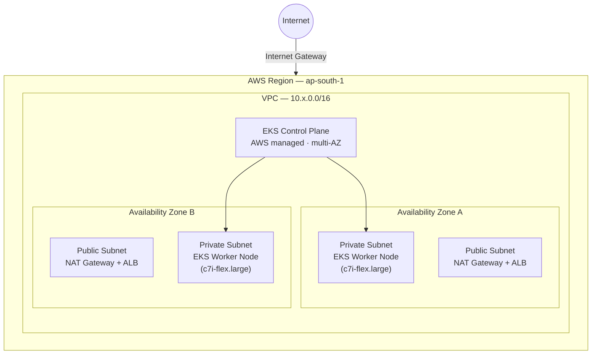

# Production-Grade EKS Platform on AWS

End-to-end, Terraform-provisioned, Azure DevOps-automated Amazon EKS platform with a controlled, zero-downtime Kubernetes upgrade path.

> **Status:** Phase 1 — Architecture & Design (approved pending one open decision, see [§9](#9-open-decisions)).
> This document is the living architecture record for the repository. Each delivery phase appends/updates the relevant section.

---

## Table of contents

1. [Project goals](#1-project-goals)
2. [Design assumptions](#2-design-assumptions)
3. [Network & cluster architecture](#3-network--cluster-architecture)
4. [Kubernetes version strategy](#4-kubernetes-version-strategy)
5. [Multi-environment strategy](#5-multi-environment-strategy)
6. [Terraform repository structure](#6-terraform-repository-structure)
7. [Remote state backend design](#7-remote-state-backend-design)
8. [Security & encryption posture](#8-security--encryption-posture)
9. [Open decisions](#9-open-decisions)
10. [Kubernetes upgrade strategy evaluation](#10-kubernetes-upgrade-strategy-evaluation)
11. [Zero-downtime upgrade requirements](#11-zero-downtime-upgrade-requirements)
12. [Delivery phase roadmap](#12-delivery-phase-roadmap)

---

## 1. Project goals

- Provision a production-grade Amazon EKS cluster fully from scratch using modular Terraform (VPC, subnets, NAT/IGW, route tables, security groups, IAM, EKS, managed node groups, CloudWatch, KMS, remote state backend).
- Automate the entire provisioning and deployment lifecycle through Azure DevOps Pipelines (validate → plan → approve → apply → deploy → upgrade → rollback).
- Run a self-hosted Azure DevOps build agent on EC2 with Terraform, kubectl, helm, and the AWS CLI pre-installed and hardened.
- Deploy a sample application via Helm with load balancing, ingress, autoscaling, and health probes.
- Demonstrate a controlled, automated, zero-downtime Kubernetes version upgrade while traffic is live.

**Cluster baseline:** 2 worker nodes, instance type `c7i-flex.large`, intentionally provisioned on an older EKS version so the upgrade path can be exercised and automated end-to-end.

---

## 2. Design assumptions

| Decision | Choice | Rationale |
|---|---|---|
| Account model | Single AWS account, 3 isolated VPCs (dev/qa/prod) | Fastest path to a working enterprise pattern; documented extension to multi-account exists (see [§9](#9-open-decisions)) |
| Region | `ap-south-1` (configurable per environment) | Default region; overridable via `tfvars` |
| Availability zones | 2 per environment (prod can extend to 3) | HA without tripling NAT Gateway cost in dev/qa |
| Node placement | Private subnets only | No public IPs on worker nodes |
| Control plane endpoint | Public + private (dev/qa); private-only documented for prod hardening | Keeps local `kubectl` access simple during build-out |

---

## 3. Network & cluster architecture



**Traffic flow:** Internet → Internet Gateway → Application Load Balancer (public subnets) → Ingress → Pods (private subnets). Outbound traffic from private subnets (image pulls, API calls) egresses through the NAT Gateway in each AZ's public subnet. The EKS control plane is AWS-managed and provisions elastic network interfaces into both private subnets to communicate with the worker nodes (kubelet, API server traffic).

---

## 4. Kubernetes version strategy

As of mid-2026, Amazon EKS standard support spans roughly the 1.34–1.35 range, with EKS 1.33 standard support ending **July 29, 2026**. To create a realistic, multi-hop upgrade scenario without starting on an already-deprecated version, this platform provisions on:

- **Starting version:** `EKS 1.30`
- **Upgrade path to be exercised:** `1.30 → 1.31 → 1.32 → 1.33 → ...` (one minor version per managed upgrade, per AWS's supported upgrade path)
- The exact version is a Terraform variable, validated against `aws eks describe-cluster-versions` at apply time, since AWS deprecates versions on a rolling schedule.

---

## 5. Multi-environment strategy

| Environment | VPC CIDR | AZs | Node count | Instance type | Starting K8s version | Notes |
|---|---|---|---|---|---|---|
| `dev` | `10.10.0.0/16` | 2 | 2 | `c7i-flex.large` | 1.30 | Single NAT Gateway (cost-optimized) |
| `qa` | `10.20.0.0/16` | 2 | 2 | `c7i-flex.large` | 1.30 | NAT Gateway per AZ |
| `prod` | `10.30.0.0/16` | 2–3 | 2 (scalable) | `c7i-flex.large` | 1.30 | NAT Gateway per AZ, stricter SGs, deletion protection |

**Naming convention:** `<project>-<env>-<resource>` — e.g. `eksplat-dev-vpc`, `eksplat-prod-eks-cluster`.

**Mandatory tags on every resource:** `Project`, `Environment`, `ManagedBy=Terraform`, `Owner`, `CostCenter`.

---

## 6. Terraform repository structure

```
terraform/
├── modules/
│   ├── state-backend/        # S3 + DynamoDB bootstrap (deployed once, local state)
│   ├── network/               # VPC, subnets, IGW, NAT GW, route tables
│   ├── security/              # Security groups, NACLs, KMS keys
│   ├── iam/                   # IAM roles/policies for cluster, nodes, IRSA, CI agent
│   ├── eks/                   # EKS control plane, OIDC provider, addons
│   ├── nodegroup/             # Managed node group(s)
│   └── monitoring/            # CloudWatch log groups, Container Insights, alarms
│
├── environments/
│   ├── dev/
│   │   ├── main.tf            # module composition for dev
│   │   ├── variables.tf
│   │   ├── terraform.tfvars
│   │   ├── backend.tf         # remote state config (key = env/dev/terraform.tfstate)
│   │   ├── providers.tf
│   │   └── outputs.tf
│   ├── qa/                    # same shape as dev
│   └── prod/                  # same shape as dev
│
└── global/
    └── bootstrap/              # one-time: creates the state-backend module's resources
        ├── main.tf
        ├── variables.tf
        └── outputs.tf
```

Each `environments/<env>` folder is a **separate Terraform root module**, not a workspace — giving isolated state files, isolated blast radius, and the ability to set different Azure DevOps approval gates per environment (dev = auto-apply, prod = manual gate). `modules/*` are reusable and environment-agnostic, parameterized entirely via variables.

---

## 7. Remote state backend design

There's a bootstrap (chicken-and-egg) problem: Terraform needs an S3 bucket + DynamoDB table to store state remotely, but those resources themselves must first be created by Terraform.

**Resolution:**

1. `global/bootstrap/` runs **once** — manually, or via a dedicated one-time pipeline stage — using **local state**, which is immediately backed up.
2. It provisions:
   - One S3 bucket: versioned, KMS-encrypted, public access blocked, bucket policy enforcing TLS-only access. Shared across all environments, isolated by key path.
   - One DynamoDB table for state locking (`LockID` hash key, on-demand billing).
3. Every `environments/<env>/backend.tf` points at that bucket with a unique state key:

   ```hcl
   bucket         = "eksplat-terraform-state-<account-id>"
   key            = "env/dev/terraform.tfstate"
   region         = "ap-south-1"
   dynamodb_table = "eksplat-terraform-locks"
   encrypt        = true
   ```

4. Environment isolation is achieved via the `key` path, not separate buckets — simpler IAM surface, while still giving each environment fully isolated state and locking.

---

## 8. Security & encryption posture

> Full implementation lands in the IAM/Security delivery phase — this is the design baseline.

- **KMS:** Customer-managed key for EKS secrets envelope encryption (`cluster_encryption_config`), a separate CMK for EBS volumes on worker nodes, and a dedicated CMK for the Terraform state S3 bucket.
- **IAM:** Least-privilege roles throughout — dedicated cluster role, node instance role (scoped to SSM, CNI, and ECR pull policies only), and per-workload IRSA roles (Cluster Autoscaler, AWS Load Balancer Controller, EBS CSI driver) instead of broad node-level permissions.
- **Security groups:** Dedicated SGs for the cluster, the nodes, and the Azure DevOps self-hosted agent, each with tightly scoped ingress/egress.
- **Network:** Worker nodes have no public IPs; all egress routes through NAT Gateways; control plane endpoint access is public+private for build-out, with a documented prod-hardening step to restrict to private-only plus a trusted CIDR allowlist.

---

## 9. Open decisions

| # | Decision | Options | Status |
|---|---|---|---|
| 1 | AWS account topology | (a) Single account, 3 VPCs *(current default)* — or (b) separate AWS account per environment via AWS Organizations + cross-account assume-role | **Pending stakeholder confirmation.** Changes the Terraform provider/backend configuration only — module logic is unaffected either way. |

---

## 10. Kubernetes upgrade strategy evaluation

Five upgrade strategies were evaluated for the live-traffic, automated upgrade scenario:

| Strategy | Downtime | Complexity | Cost overhead | Rollback speed | Production fit |
|---|---|---|---|---|---|
| **A. Managed Node Group rolling upgrade** | Near-zero (with PDB + surge) | Low | Low | Fast — re-apply prior launch template | ✅ **Default / primary strategy** |
| **B. Blue-green cluster upgrade** | Zero (DNS/LB cutover) | High | High — two full clusters running concurrently | Instant — flip traffic back | ✅ Reserved for major/high-risk version jumps |
| **C. Canary node group upgrade** | Near-zero | Medium | Low–medium | Fast — scale canary group to zero | ✅ Safety layer applied on top of strategy A |
| **D. New cluster + traffic migration** | Low–medium (migration window) | Very high | High — temporary dual infrastructure | Moderate — re-point traffic | ⚠️ Reserved for cross-major-version jumps or re-architecture events |
| **E. Cluster Autoscaler–assisted upgrade** | Near-zero | Low | Low | Fast | ✅ Always-on complement, not a standalone strategy |

### Decision

- **Primary, pipeline-automated strategy: A — Managed Node Group rolling upgrade.** Surge-based node replacement driven by Terraform's `update_config` block plus Azure DevOps pipeline stages, protected by PodDisruptionBudgets, readiness probes, and ALB health checks.
- **Production enhancement: strategy C layered on A.** For `prod` only — upgrade a small canary node group first, validate workload health and metrics, then proceed with the full rolling upgrade. Implemented as a conditional path in the prod pipeline.
- **Strategy E is a standing requirement, not a separate path.** The Cluster Autoscaler (or Karpenter, flagged as an alternative worth evaluating) must be running throughout any upgrade so surge capacity actually exists when needed.
- **Strategies B and D are documented and scaffolded but not part of the default automated path.** They're the "break-glass" options for a major version jump or disaster recovery scenario — not justified as the everyday upgrade mechanism for a 2-node platform at this scale.

> Full architecture diagrams, Terraform deltas, and Azure DevOps pipeline YAML for each strategy (A–E) are delivered in the dedicated **Kubernetes Upgrade** phase, once a running cluster exists to upgrade.

---

## 11. Zero-downtime upgrade requirements

During any upgrade, the application must remain available with no traffic loss. This is enforced via:

- **PodDisruptionBudgets** on all application deployments
- **Multiple replicas** scheduled across both availability zones
- **Readiness and liveness probes** gating traffic admission per pod
- **Graceful node draining** (`cordon` → `drain` → respect PDB) before node termination
- **Surge capacity** during rolling node replacement (extra nodes provisioned before old ones are removed)
- **Load balancer health checks** deregistering unhealthy targets before they receive traffic

---

## 12. Delivery phase roadmap

| Phase | Deliverable |
|---|---|
| 1 | Architecture, environment layout, repo structure, backend design, upgrade strategy selection *(this document)* |
| 2 | `state-backend` + `network` Terraform modules |
| 3 | `iam` + `security` Terraform modules |
| 4 | `eks` + `nodegroup` Terraform modules |
| 5 | `monitoring` module + full `dev` environment composition |
| 6 | Azure DevOps self-hosted agent (EC2) — provisioning + hardening |
| 7 | Azure DevOps pipeline YAML — Validate → Plan → Approval → Apply |
| 8 | Helm-based sample app deployment (LB, Ingress, HPA, probes, monitoring) |
| 9 | Validation: app availability, node health, autoscaling, ingress routing |
| 10 | Kubernetes upgrade automation (strategy A + C implementation, PDBs, rollback) |
| 11 | QA/Prod promotion, final hardening review |

---

*This README is updated at the end of every phase. Treat it as the single source of truth for platform architecture decisions.*
